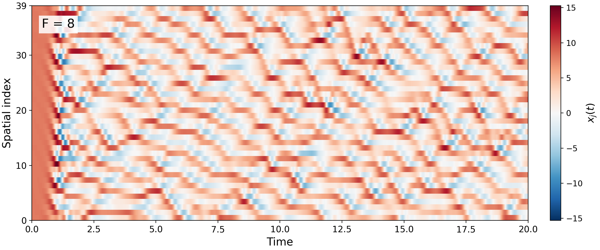

# Lorenz-96 with RK4

This project solves the 40-dimensional Lorenz-96 system

```math
\dot{x}_j=(x_{j+1}-x_{j-2})x_{j-1}-x_j+F,
\qquad x_{j+40}=x_j,
```

using the classical fixed-step fourth-order Runge-Kutta method.



## Reproducible run

The committed result uses:

- `N = 40`
- `F = 8`
- `t in [0, 20]`
- `dt = 0.01`
- `seed = 20260917`
- `x_j(0) = F + epsilon_j`, where `epsilon_j ~ Normal(0, 0.01^2)`

The fixed seed makes the randomly perturbed initial state reproducible. The
exact values are stored in `results/initial_condition.csv`.

## Run

```bash
python -m pip install -r requirements.txt
python solve_lorenz96.py
```

Optional parameters:

```bash
python solve_lorenz96.py --forcing 8 --n 40 --t-end 20 --dt 0.01 --seed 20260917
```

Outputs:

- `results/lorenz96_rk4.png`: space-time heatmap
- `results/lorenz96_rk4.csv`: time and all 40 state components
- `results/initial_condition.csv`: initial state

## Test

```bash
python -m unittest -v
```

The tests verify periodic indexing, preservation of the constant equilibrium,
and the expected fourth-order convergence on a reduced problem with a known
exact solution.
