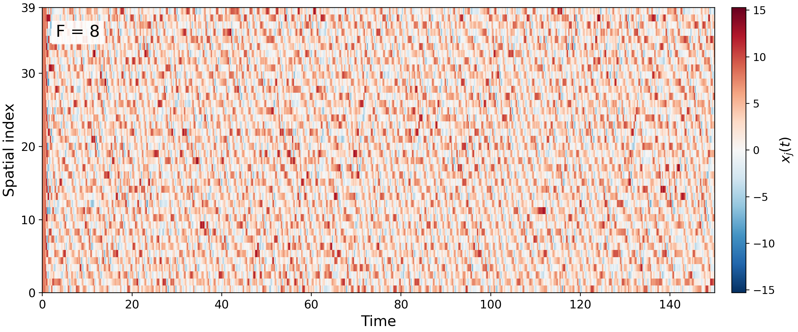

# Lorenz-96 with RK4

This project solves the 40-dimensional Lorenz-96 system

```math
\dot{x}_j=(x_{j+1}-x_{j-2})x_{j-1}-x_j+F,
\qquad x_{j+40}=x_j,
```

using the classical fixed-step fourth-order Runge-Kutta method.



## Reproducible run

The committed result uses:

- `N = 40`
- `F = 8` and `F = 64` (same numerical settings)
- `t in [0, 20]`
- `dt = 0.01`
- `seed = 20260917`
- `x_j(0) = F + epsilon_j`, where `epsilon_j ~ Normal(0, 0.01^2)`

The fixed seed makes the randomly perturbed initial state reproducible. The
exact values are stored in `results/initial_condition.csv`.

## Run

```bash
python -m pip install -r requirements.txt
python solve_lorenz96.py
```

Optional parameters:

```bash
python solve_lorenz96.py --forcing 8 --n 40 --t-end 20 --dt 0.01 --seed 20260917
```

Outputs:

- `results/lorenz96_rk4.png`: space-time heatmap
- `results/lorenz96_rk4.csv`: time and all 40 state components
- `results/lorenz96_rk4_F8.png` and `results/lorenz96_rk4_F64.png`: space-time heatmaps
- `results/lorenz96_rk4_F8.csv` and `results/lorenz96_rk4_F64.csv`: time and all 40 state components
- `results/initial_condition_F8.csv` and `results/initial_condition_F64.csv`: initial states

## Decorrelation and effective sample size

Run the analysis after generating both trajectories:

```bash
python analyze_correlations.py
```

The analysis discards the initial `t < 5` transient, computes a time ACF for
each of the 40 spatial components, applies the Ljung–Box test at lag 50, and
estimates the integrated autocorrelation time using the initial-positive
sequence. For each component,

```text
ESS = n_samples / tau_int
```

Results are written to `results/correlation/`, including per-component CSV
files, ACF arrays, a comparison figure, and `summary.txt`. A Ljung–Box
`p > 0.05` means the test does not reject the null hypothesis of no temporal
autocorrelation through lag 50; it is not proof that the samples are exactly
independent.

For this run (`n_samples = 1501` per component after burn-in):

| Forcing | Median ESS | ESS range | Median integrated autocorrelation time | Ljung–Box Q(50) p > 0.05 |
|---:|---:|---:|---:|---:|
| 8 | 34.01 | 27.94–43.81 | 0.4413 | 0 / 40 |
| 64 | 124.02 | 74.09–167.19 | 0.1210 | 0 / 40 |

The higher forcing case decorrelates faster in this simulation, so its
effective sample size is larger despite the same raw number of time points.

## Test

```bash
python -m unittest -v
```

The tests verify periodic indexing, preservation of the constant equilibrium,
and the expected fourth-order convergence on a reduced problem with a known
exact solution.
